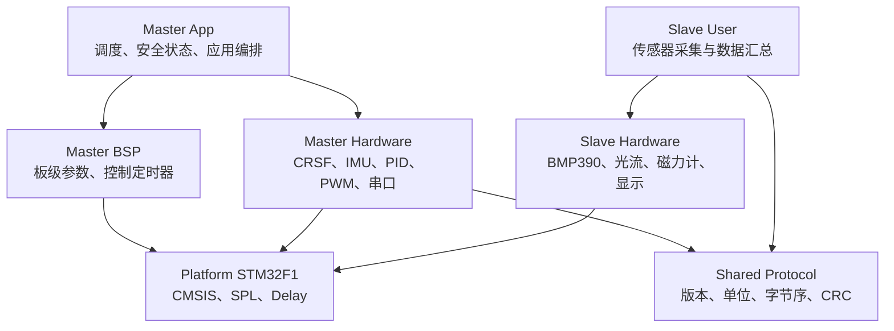

# 总体架构

## 分层

依赖只能向下。`Shared/Protocol` 是纯 C，不依赖 STM32，因此同一实现可以同时被固件和电脑端测试编译。

## 主控运行模型

| 周期 | 频率 | 任务 | 中断职责 |
|---:|---:|---|---|
| 2 ms | 500 Hz | IMU 滤波、陀螺仪读取、角速度内环 | TIM2 只发布任务 |
| 5 ms | 200 Hz | CRSF 数据处理和单调时基 | TIM1 计数并发布任务 |
| 10 ms | 100 Hz | 姿态读取和角度外环 | TIM3 只发布任务 |
| 20 ms | 50 Hz | 电机寄存器更新和低频遥测 | TIM4 只发布任务 |

任务通知采用单个 pending 位。任务尚未消费时再次到期，不会把旧控制周期排队重放，而是增加 overrun 计数。这能暴露实时性不足，也避免使用固定 `dt` 的 PID 在拥塞恢复后连续运行多次。

## 主从边界

从控将传感器值转换为有明确单位的整数，然后由共享协议编码。主控完成 CRC、版本、长度和序号检查后，再转换为应用使用的浮点单位。两端不共享内存结构布局，也不传输原始 `float` 字节。

## 中断原则

允许在中断中执行：

- 清除硬件标志；
- 搬运必要的接收字节；
- 更新时间计数；
- 发布主循环任务；
- 完成有严格时限的 DMA/串口应答。

滤波、协议业务逻辑、PID、格式化和阻塞等待应留在主循环。
