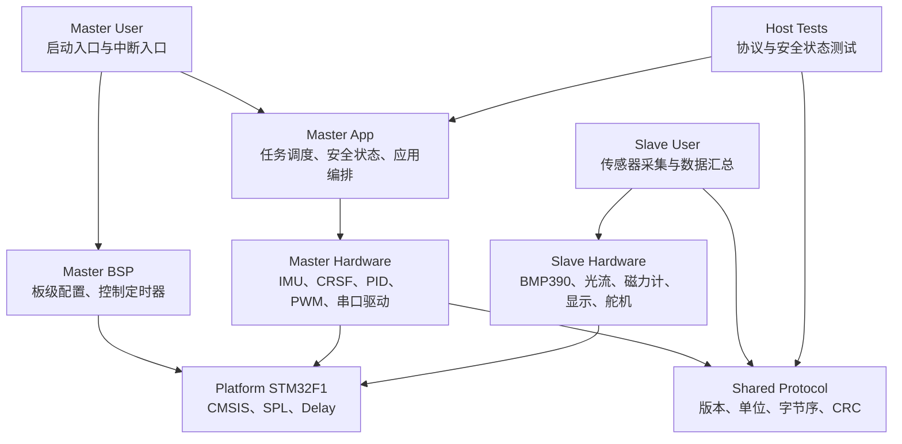
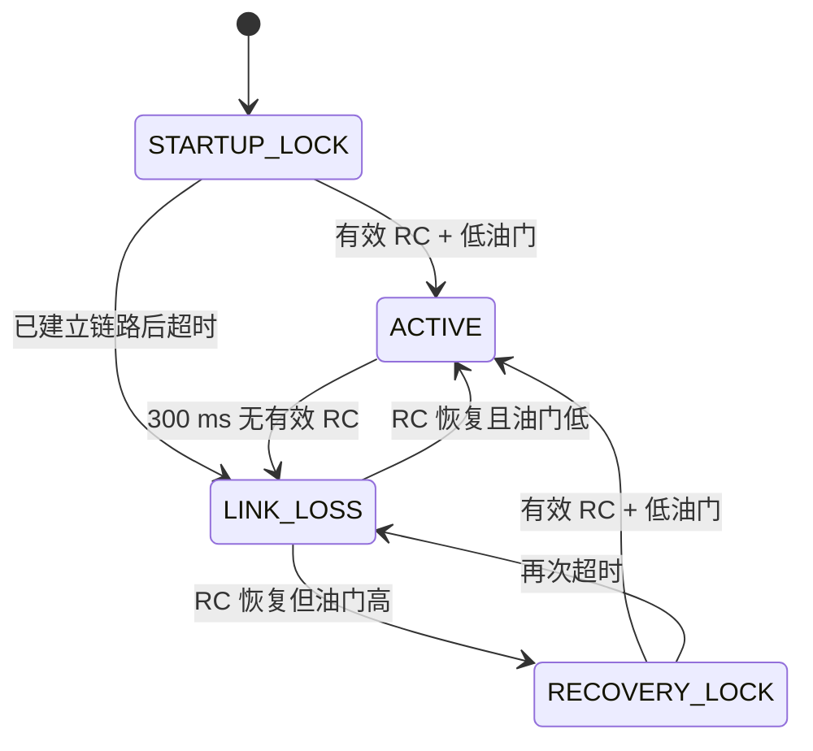

# Quadcopter 项目架构说明

## 1. 文档目的

本文总结 `develop` 分支以下 4 个工程化提交带来的架构演进：

| Commit | 主题 | 架构层面目标 |
|---|---|---|
| `4f45172` | Share STM32F1 platform sources | 消除 Master/Slave 重复的平台代码 |
| `6952c0c` | Version inter-MCU sensor protocol | 建立稳定、可测试的主从通信契约 |
| `0bb2a18` | Make master runtime deterministic | 建立确定性任务调度和显式安全状态 |
| `7d9d78c` | Add firmware engineering quality gates | 补齐 BSP、构建、测试、CI 和文档治理 |

这次改造没有把项目变成新的飞控产品，也没有引入 RTOS 或扩展飞行功能。核心目标是把原有“可以编译运行的双 MCU 程序”，升级为“边界清楚、行为可解释、变化可验证的 STM32 飞控工程”。

---

## 2. 修改前架构的问题

### 2.1 平台代码重复

Master 和 Slave 各自保存了一套完全相同的：

- CMSIS 与启动文件；
- STM32F10x Standard Peripheral Library；
- `Delay` 系统服务。

这会产生两个问题：

1. 同一个底层缺陷需要修改两次；
2. 两份代码可能在后续维护中逐渐产生差异，形成无法察觉的平台分叉。

这种结构适合从示例工程快速复制出两个可运行项目，但不适合长期维护的多目标固件仓库。

### 2.2 应用、硬件和策略混在一起

主控的 `main.c` 同时承担：

- 系统初始化；
- 遥控数据映射；
- 飞行安全判断；
- PID 调用；
- 传感器数据同步；
- 电机输出；
- 蓝牙遥测格式化；
- TIM1/TIM2/TIM3/TIM4 中断处理。

板级参数、应用策略和硬件寄存器操作缺乏明确边界。修改一个周期、通道或安全条件时，需要直接进入主程序和中断代码，影响范围不容易判断。

### 2.3 主从协议依赖编译器内存布局

原主从协议直接发送 `__packed struct`，其中包含多个 `float`，并使用强制指针转换解析。

主要风险包括：

- 依赖 ARMCC 的结构体布局；
- 依赖 MCU 端序；
- 依赖两端 `float` 表示完全一致；
- 非对齐指针访问存在可移植性风险；
- 没有协议版本，字段变化无法协商；
- 单字节异或校验发现错误的能力较弱；
- 没有序号、时间戳和数据有效性标志；
- Master 与 Slave 必须通过阅读彼此实现才能理解字段语义。

这属于“实现偶然一致”，还不是稳定的模块接口。

### 2.4 中断执行时间过长且不可预测

TIM2 中断中直接执行：

- 互补滤波；
- 陀螺仪读取；
- 浮点计算；
- 角速度数据更新。

TIM3 中断也直接读取姿态。中断和主循环之间依靠多个二值标志交换任务。

存在的问题：

- 浮点算法使中断占用时间增长；
- 低优先级通信中断可能被延迟；
- 二值标志无法区分“执行了一次”和“漏掉了多次”；
- 主循环拥塞恢复后缺少 overrun 诊断；
- 控制算法、调度机制和硬件定时器紧密耦合。

### 2.5 安全逻辑由分散布尔量组成

原安全行为依赖多个变量组合：

- `rc_link_ok`；
- `rc_failsafe_active`；
- `rc_throttle_unlocked`；
- `last_valid_rc_tick`。

虽然已经具备低油门锁和失联停机能力，但状态之间的合法转换没有被显式表达。随着 ARM/DISARM、传感器健康检查或故障恢复条件增加，布尔组合很容易出现矛盾状态。

### 2.6 板级资源所有权不清楚

原 `PWM1`、`PWM3` 文件实际上只使用 TIM2、TIM3 产生周期中断，却仍配置了 PWM 复用引脚：

- TIM2 路径配置 PA2，与 CRSF USART2 冲突；
- TIM3 路径配置 PA6，与 MPU6050 软件 I2C 冲突。

最终初始化顺序可能暂时覆盖这些错误配置，但这是典型的隐式时序耦合：程序能运行依赖“后初始化的模块把前一个模块的配置改回来”。

### 2.7 缺少自动质量门槛

修改前主要依赖人工打开 Keil 工程验证：

- 没有仓库级构建入口；
- 没有电脑端单元测试；
- 没有 Keil 工程路径检查；
- 没有 GitHub CI；
- 没有完整架构、协议、引脚和安全文档；
- 无法自动发现项目文件引用丢失或公共代码重新复制的问题。

---

## 3. 修改后的总体设计思想

### 3.1 分层架构



核心依赖规则：

1. `Platform` 不依赖 Master 或 Slave；
2. `Shared` 不依赖 STM32 寄存器和具体板卡；
3. `App` 负责策略，不直接拥有具体引脚；
4. `BSP` 负责板级时钟、定时器和资源映射；
5. `Hardware` 负责设备驱动和控制算法；
6. `User` 负责启动、编排和中断入口，不承载可复用协议。

### 3.2 设计重点

本次设计遵循以下原则：

- **单一事实来源**：公共平台代码和主从协议只保存一份；
- **接口优先**：MCU 之间通过协议契约通信，而不是共享内存布局；
- **中断最小化**：中断负责通知和硬件应答，业务计算回到主循环；
- **显式状态优先**：使用状态机表达安全过程，不使用不断增加的布尔组合；
- **配置集中化**：周期、通道、超时和安全阈值集中在 BSP 配置中；
- **可移植测试**：与硬件无关的逻辑必须能够在电脑端编译；
- **变化可验证**：每次架构变化同时提供日志、测试或构建证据。

---

## 4. 四个 Commit 的架构变化

### 4.1 Commit `4f45172`：公共 STM32F1 平台层

### 修改前

```text
Master_MCU/
├── Start/
├── Library/
└── System/

Slave_MCU/
├── Start/
├── Library/
└── System/
```

两套目录共有 61 个内容完全相同的文件。

### 修改后

```text
Platform/STM32F1/
├── CMSIS/
├── SPL/
└── System/

Master_MCU/Project.uvprojx ──┐
                             ├──> Platform/STM32F1
Slave_MCU/Project.uvprojx  ──┘
```

### 设计思想

- 把芯片平台视为独立基础设施；
- Master 和 Slave 只保留自身应用与硬件差异；
- 两个 Keil 目标引用同一套底层源文件；
- 平台修复只需要发生一次。

### 工程价值

- 删除约 4.2 万行重复文件；
- 防止公共库在两个目标中产生版本漂移；
- 为未来增加第三个固件目标或迁移工具链建立统一入口；
- 本次提交不改变控制算法、协议和引脚行为。

### 对应嵌入式技能

- CMSIS、启动文件和 STM32 SPL 组织方式；
- 多目标 Keil 工程管理；
- 平台层与产品应用层分离；
- 安全进行大规模文件迁移并保持二进制行为不变；
- 使用双目标编译证明纯结构重构没有破坏构建。

---

### 4.2 Commit `6952c0c`：版本化主从通信协议

### 修改前


协议定义散落在 Master 和 Slave 实现中，双方通过编译器布局形成隐式耦合。

### 修改后


协议帧包含：

- 双字节 magic；
- 协议版本和消息类型；
- 明确的 payload 长度；
- 帧序号；
- 传感器有效性标志；
- 从控时间戳；
- 明确单位的定宽整数；
- CRC16-CCITT。

### 设计思想

- 通信协议是模块边界，不是结构体序列化的副作用；
- wire format 与编译器、结构体对齐和浮点表示解耦；
- 编码和解码共用同一份纯 C 实现；
- 先验证完整性，再向应用发布数据；
- 通过序号和错误计数提供链路可观测性。

### 工程价值

- 消除 Master/Slave 对 `packed struct` 和裸 `float` 的依赖；
- 可以发现丢帧、CRC 错误和格式错误；
- 协议升级有明确版本边界；
- 同一编解码实现可被固件和电脑端测试共同验证；
- 明确形成“本版本主从固件必须成对烧录”的发布规则。

### 对应嵌入式技能

- 串口协议与帧格式设计；
- 端序、对齐、定宽整数和二进制兼容性；
- CRC16 原理与实现；
- 数据单位和量化范围设计；
- 流式接收、重新同步和错误诊断；
- 面向接口的软硬件协同设计；
- 使用 host test 验证嵌入式纯 C 模块。

---

### 4.3 Commit `0bb2a18`：确定性运行模型与安全状态机

### 修改前

TIM2/TIM3 中断直接执行滤波、传感器读取和浮点计算，主循环依靠多个二值标志判断是否调用 PID。遥控安全状态由多个独立布尔量组合。

### 修改后：周期任务模型

| 周期 | 频率 | 任务 | 中断职责 |
|---:|---:|---|---|
| 2 ms | 500 Hz | IMU 滤波、陀螺仪读取、角速度内环 | TIM2 发布任务 |
| 5 ms | 200 Hz | CRSF 处理和系统时基 | TIM1 计数并发布任务 |
| 10 ms | 100 Hz | 姿态读取和角度外环 | TIM3 发布任务 |
| 20 ms | 50 Hz | 电机更新和低频遥测 | TIM4 发布任务 |

中断现在只执行：

- 硬件状态检查；
- 时间计数；
- 任务通知；
- 中断标志清除。

任务通知采用 coalescing 设计：一个任务尚未处理时再次到期，不会在恢复后连续重放旧控制周期，而是增加 overrun 计数。

### 修改后：安全状态机



只有 `ACTIVE` 允许输出混控结果。其他状态统一执行：

- 基础油门归零；
- 姿态目标归零；
- PID 输出和积分清零；
- 四路电机写入最小输出。

### 设计思想

- 定时器决定任务释放时刻，主循环决定业务执行；
- 高优先级中断不承担可变时长的浮点业务；
- 固定周期算法不重放已经过期的控制帧；
- 安全策略用有限状态机表达合法转换；
- 时间差使用无符号运算，允许 32 位计数自然回绕；
- 周期、通道、超时和阈值集中放入 `board_config.h`。

### 工程价值

- ISR 执行时间更短、更容易估计；
- 遥控、通信和传感器中断受到的干扰更小；
- overrun 从“静默丢失”变成可诊断数据；
- 启动、失联和重连行为有统一、可测试的状态模型；
- 后续增加 ARM/DISARM、传感器健康门槛时有明确扩展位置。

### 对应嵌入式技能

- 裸机多速率任务调度；
- 中断优先级和 ISR 最小化；
- 主循环与中断之间的并发数据处理；
- 实时系统 deadline、overrun 和任务合并策略；
- 串级 PID 的周期约束；
- 有限状态机设计；
- failsafe、低油门锁和故障恢复；
- 计数器回绕安全的超时判断；
- 将安全策略提取为可在电脑端测试的纯逻辑模块。

---

### 4.4 Commit `7d9d78c`：工程质量门槛与 BSP 收敛

### 修改前

- `PWM1`、`PWM3`、`Timer1` 名称不能准确表达真实职责；
- 定时器模块会配置并不使用的 PWM 引脚；
- 引脚冲突依赖初始化顺序暂时掩盖；
- 构建依赖人工打开两个 Keil 工程；
- 没有自动检查工程引用、测试和文档完整性。

### 修改后

#### BSP 资源所有权

TIM1/TIM2/TIM3 被统一收敛到：

```text
Master_MCU/BSP/
├── board_config.h
├── control_timers.c
└── control_timers.h
```

`control_timers` 只配置时基和 NVIC，不再配置 PA2、PA6 等无关 GPIO，从结构上消除 CRSF 和 MPU6050 的隐式引脚冲突。

#### 质量门槛


新增内容包括：

- 根目录 `CMakeLists.txt`；
- 协议和安全状态电脑端测试；
- Keil 工程源文件和 include 路径校验；
- Master/Slave 统一 ARMCC 构建脚本；
- GitHub Actions；
- README、构建、引脚、协议、安全和路线图文档；
- 提交与安全变更协作规范。

### 设计思想

- BSP 必须拥有并解释板级资源；
- 模块名称应表达真实职责；
- 构建成功不应依赖某个工程师的手工操作；
- 可以脱离硬件的逻辑应进入自动测试；
- CI 负责快速发现结构和接口回归；
- Keil/ARMCC 真机目标构建仍作为发布门槛；
- 架构决策、协议变化和已知安全限制必须写入版本日志。

### 工程价值

- 消除两个实际 GPIO 资源冲突；
- 提供从仓库根目录开始的统一验证流程；
- 工程文件引用丢失可在提交阶段被发现；
- Master 和 Slave 构建结果可重复；
- 新成员可以通过文档理解架构边界，而不必先阅读全部源码；
- 项目开始具备持续集成和配置管理能力。

### 对应嵌入式技能

- BSP 与硬件资源表设计；
- 定时器、GPIO、DMA、USART 资源冲突分析；
- Keil 多目标自动构建；
- CMake 与跨平台 host test；
- Python 工程一致性检查；
- GitHub Actions 持续集成；
- 版本日志和技术文档；
- 可追溯的软件配置管理。

---

## 5. 修改前后对比

| 维度 | 修改前 | 修改后 |
|---|---|---|
| 平台代码 | Master/Slave 各自复制 | `Platform/STM32F1` 单一来源 |
| 主从接口 | packed struct、裸 float、XOR | 版本化定长协议、明确单位、CRC16 |
| 协议诊断 | 只有是否收到 | CRC、格式、序号和帧计数 |
| 实时执行 | 滤波和读取在 ISR | ISR 发布任务，主循环执行算法 |
| 任务丢失 | 二值标志静默覆盖 | coalescing + overrun 计数 |
| 安全策略 | 多个布尔变量组合 | 四状态安全状态机 |
| 配置 | 周期、通道和阈值散落 | `board_config.h` 集中管理 |
| 定时器所有权 | 多个误导性 PWM 文件 | `BSP/control_timers` 统一管理 |
| 引脚冲突 | 依赖初始化顺序覆盖 | 移除无关 GPIO 配置 |
| 测试 | 主要依赖硬件和人工 | 纯 C host tests + Keil 双构建 |
| 自动检查 | 无 | Python 校验 + GitHub Actions |
| 文档 | 注释为主 | 架构、构建、协议、引脚、安全文档 |

---

## 6. 与嵌入式工程师能力模型的对应关系

| 能力领域 | 本项目中的具体证据 | 对应工程能力 |
|---|---|---|
| MCU 基础 | CMSIS、启动文件、SPL、时钟、NVIC | 能理解程序从复位到应用运行的底层链路 |
| 外设驱动 | GPIO、TIM、USART、DMA、ADC、SPI、软件 I2C | 能配置和调试 STM32 常用外设 |
| 资源规划 | 主从引脚表、DMA 通道、定时器所有权 | 能发现并消除外设复用冲突 |
| 架构分层 | Platform、Shared、App、BSP、Hardware、User | 能从“功能堆积”转向有依赖规则的工程 |
| C 语言底层能力 | 定宽整数、端序、对齐、volatile、回绕运算 | 能处理嵌入式 C 的平台相关细节 |
| 通信协议 | 帧格式、版本、长度、CRC、序号、状态标志 | 能设计可升级、可诊断的 MCU 间协议 |
| 实时系统 | 多速率调度、ISR 最小化、overrun | 能分析任务周期、优先级和 deadline |
| 控制系统集成 | 500 Hz 内环、100 Hz 外环、50 Hz 输出 | 能把控制算法放入合适的实时执行模型 |
| 功能安全意识 | 低油门锁、失联、恢复锁、安全输出 | 能从故障模式而不是正常路径设计系统 |
| 可测试性 | 协议和安全状态纯 C 测试 | 能主动把硬件依赖与业务逻辑分离 |
| 构建工程 | 双 Keil 目标、CMake、统一脚本 | 能维护多固件目标和可复现构建 |
| CI/CD | GitHub Actions、工程路径校验 | 能建立持续反馈和回归防线 |
| 配置管理 | 小步 commit、CHANGELOG、分支策略 | 能让变更可审查、可追踪、可回退 |
| 技术沟通 | 架构、协议、引脚和安全文档 | 能把隐含知识转化为团队资产 |

从能力层级看：

- 只会配置外设和完成单个功能，属于“功能实现”；
- 能完成协议、并发、状态机和模块边界设计，进入“系统设计”；
- 能同时建立构建、测试、CI、日志和发布约束，才接近“工程交付”。

这 4 个提交覆盖的重点已经从单纯 STM32 编程，扩展到嵌入式系统架构、实时设计、安全设计和工程治理。

---

## 7. 当前架构边界与剩余工作

本次改造建立了工程基线，但以下事项尚未完成：

1. **正式 ARM/DISARM**
   - 当前是低油门启动和恢复锁；
   - 尚未绑定独立 ARM 通道；
   - 还不能等同于产品级解锁流程。

2. **传感器健康管理**
   - 协议已有数据有效性标志；
   - Master 尚未将所有传感器健康、新鲜度和范围检查纳入解锁条件。

3. **算法模块纯化**
   - PID 和姿态算法仍位于 Hardware 目录；
   - 后续应拆为不依赖 STM32 的算法模块，并增加数值测试。

4. **遗留驱动治理**
   - 部分未在 `main` 初始化的驱动仍保留在默认 Keil 目标中；
   - 启用前需要完成资源审查，长期应移出默认产品构建。

5. **参数系统**
   - 调参入口已有范围校验；
   - 尚缺统一参数表、版本、持久化、默认值恢复和掉电一致性。

6. **硬件在环验证**
   - 当前自动测试覆盖纯逻辑；
   - 仍需要无桨台架、故障注入、系留和 Hardware-in-the-loop 测试。

7. **工具链自动化**
   - GitHub 公共 runner 运行 host tests；
   - ARMCC 构建仍依赖本地 Keil，后续可接入自托管 Windows runner，或评估 GNU Arm 工具链。

---

## 8. 总结

四个提交形成了连续的架构演进：

```text
复制式双工程
    ↓
共享平台层
    ↓
稳定的主从协议边界
    ↓
确定性调度与显式安全状态
    ↓
BSP、自动测试、构建、CI 和文档治理
```

修改前，项目的主要价值是“功能已经连起来”；修改后，项目开始具备以下企业嵌入式工程特征：

- 公共基础设施只有一个可信来源；
- MCU 之间有明确、可升级的接口；
- 中断和应用任务有清楚的执行边界；
- 安全行为由状态机定义；
- 板级资源有明确所有者；
- 核心纯逻辑可以脱离硬件测试；
- 每次变化都有构建、测试、日志和文档证据。

这套架构还不是完整量产飞控架构，但已经从个人实验代码进入了可持续工程化演进的阶段。
