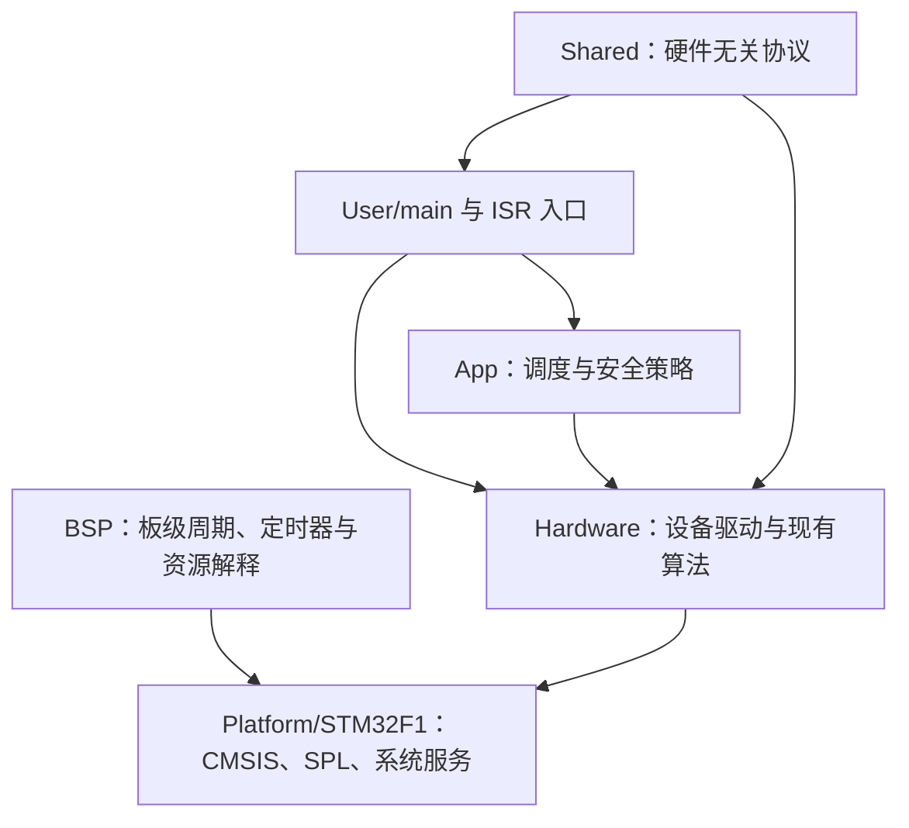
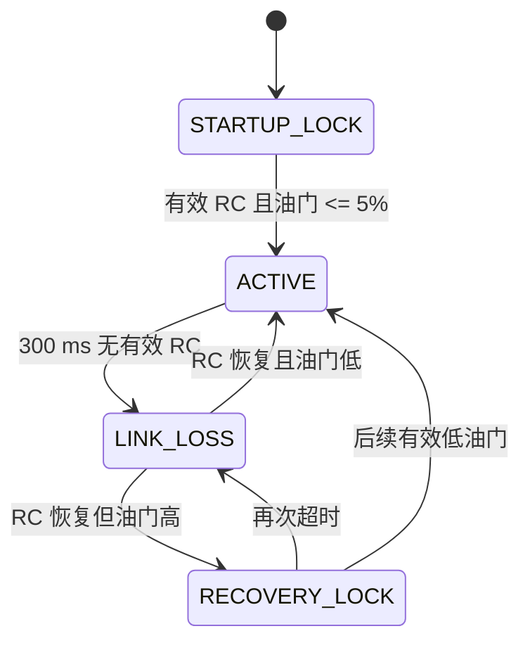

# develop 分支嵌入式工程化学习指南

## 1. 这份指南解决什么问题

`develop` 不是简单地“把目录整理了一下”。它记录了一个双 STM32 四旋翼项目从
“可以运行的个人工程”向“可理解、可测试、可维护的嵌入式工程”演进的完整基础过程。

本指南面向希望通过真实项目学习嵌入式软件的学生。目标不是让你背诵代码，而是让你能够：

- 从 Cortex-M3 上电入口追踪到主循环；
- 理解 CMSIS、SPL、BSP、App、协议和算法的边界；
- 设计不依赖编译器内存布局的二进制协议；
- 理解裸机多速率调度、ISR 最小化、deadline 和 overrun；
- 用状态机表达遥控失联和电机放行策略；
- 用 Host 单元测试验证硬件无关的纯 C 模块；
- 使用 CMake、CTest、Python、PowerShell、Keil 和 GitHub Actions 建立质量门禁；
- 写出可以交接、维护、发布和回滚的工程文档；
- 用版本证据说明“为什么改、改了什么、怎么证明没有破坏系统”。

课程代码基线是：

| 角色 | Commit | 说明 |
|---|---|---|
| 改造前基线 | `05105d5` | `main`：已具备 RC failsafe 和 PID 更新保护 |
| 课程实现终点 | `6036ce7` | `develop`：基础工程化和维护文档完成 |
| 本指南 | 后续文档提交 | 只增加教学入口，不改变固件行为 |

完整架构事实以 [总体架构](ARCHITECTURE.md) 为准；本指南重点回答“作为学生应该怎么学、
怎么看代码、怎么做实验、怎样证明自己真正掌握了”。

---

## 2. 安全边界

### 2.1 学习状态必须明确区分

做项目笔记和面试介绍时，必须区分：

1. **已实现并接入运行路径**：固件当前确实调用；
2. **已实现但未接入**：代码存在，但默认产品路径没有使用；
3. **仅设计或接口预留**：只有文档、计划或契约，不能说成已经运行；
4. **已完成硬件验证**：有无桨台架、示波器、逻辑分析仪或 HIL 证据；
5. **已完成飞行验证**：必须有受控测试记录，不能由“编译通过”推断。

### 2.2 初学阶段禁止直接改动

以下模块先只读学习，不作为前几周的修改实验：

- PID 计算公式和系数；
- 姿态解算、Kalman/滤波算法；
- 四旋翼电机混控方向；
- TIM4 ESC PWM 周期和脉宽；
- 电机最小输出与安全状态放行条件。

`main..develop` 没有修改 `Master_MCU/Hardware/Pid.c/.h`。工程化学习的重点是保护既有
控制行为，而不是借重构之名重新调参。

### 2.3 硬件实验规则

- 所有电机相关实验必须拆除桨叶；
- 优先断开 ESC 动力，只保留控制板和测量仪器；
- 使用测试 GPIO 前先检查 [硬件资源与引脚](PINOUT.md)；
- 不得把示波器地夹接到错误电位；
- 主从协议版本变化后必须成对烧录；
- Host 测试通过不等于可以直接飞行；
- 当前没有正式 ARM/DISARM 开关，低油门锁只能视为基础保护。

---

## 3. 如何按版本学习

### 3.1 先建立个人学习分支

不要直接在 `develop` 上做破坏性实验：

```powershell
git switch develop
git status --short --branch
git switch -c study/develop-course
```

实验结束后，只把学习笔记、测试或经过验证的独立改进提交到个人分支。

### 3.2 查看一个版本

```powershell
git show --stat 4f45172
git show --name-status 4f45172
git diff 4f45172^ 4f45172
```

阅读历史源码而不切换工作树：

```powershell
git show 6952c0c:Shared/Protocol/inter_mcu_protocol.c
```

临时进入某个历史版本：

```powershell
git switch --detach 6952c0c
```

读完必须回到自己的学习分支：

```powershell
git switch study/develop-course
```

### 3.3 每个版本使用同一套分析模板

每次版本考古都回答：

1. 修改前的工程问题是什么？
2. 哪些约束不能被破坏？
3. 这个版本改变了结构、行为，还是只改变了流程/文档？
4. 新的模块边界是什么？
5. 最关键的代码入口和数据流是什么？
6. 失败时系统怎样表现？
7. 用什么测试或构建证据证明修改有效？
8. 还有哪些风险没有覆盖？

---

## 4. 项目全景

### 4.1 两颗 MCU 的职责

| 控制器 | 主要职责 |
|---|---|
| Master STM32F103C8T6 | CRSF 遥控、MPU6050、姿态解算、串级 PID、安全状态、四路电机输出 |
| Slave STM32F103C8T6 | 气压计、光流、磁力计、电池、舵机、OLED/OSD、传感器汇总 |

### 4.2 基础分层



`develop` 仍处于逐步分层阶段：`Hardware` 中既有设备驱动，也保留 PID、姿态等算法，
`main.c` 仍承担较多编排。这是已记录的技术债，不应被描述成最终企业架构。

### 4.3 三条最重要的数据链

#### 从控传感器链

```text
Slave 采样
→ 明确单位和定宽整数
→ InterMcu_EncodeSensorFrame
→ USART2
→ Master USART3 DMA/IDLE
→ Slave_TryExtractFrame
→ InterMcu_DecodeSensorFrame
→ Slave_ApplyPacket
→ Master 主循环消费
```

#### 控制任务链

```text
硬件定时器到期
→ ISR 发布任务
→ AppScheduler pending/overrun
→ main 领取任务
→ 读取传感器与 RC
→ 姿态/PID/mixer
→ FlightSafety_MotorsAllowed
→ TIM4 PWM compare
```

#### 质量验证链

```text
validate_project.py
→ Host CMake build
→ CTest
→ Master/Slave ARMCC build
→ 无桨台架
→ 发布与回滚记录
```

---

## 5. 技术栈能力矩阵

| 技术域 | 在本项目中的载体 | 学完后应能做到 |
|---|---|---|
| C 语言基础 | 定宽整数、位运算、枚举、结构体、静态函数 | 解释端序、补码、溢出、对象生命周期 |
| Cortex-M3 | 启动文件、向量表、NVIC、`SystemInit` | 画出 Reset 到 `main` 的执行链 |
| STM32 SPL | RCC、GPIO、TIM、USART、DMA | 读懂外设初始化与中断配置 |
| Keil 工程 | 两个 `.uvprojx`、ARMCC 构建 | 管理多目标 source/include，读构建日志 |
| 软件分层 | Platform、BSP、App、Hardware、Shared | 判断一段代码应该属于哪一层 |
| 通信协议 | `inter_mcu_protocol.*` | 设计 framing、版本、长度、CRC、sequence |
| 数据表示 | 小端、定宽整数、明确单位 | 避免 packed struct、裸 float 和隐式缩放 |
| 裸机实时系统 | scheduler、2/5/10/20 ms 周期 | 解释 deadline、WCET、jitter、overrun |
| 中断设计 | TIM/USART ISR 与主循环 | 将 ISR 限制为确认、搬运和通知 |
| 安全状态机 | `flight_safety.*` | 设计 guard、超时、恢复锁和安全默认值 |
| 板级设计 | `board_config.h`、`control_timers.*` | 管理引脚、定时器、NVIC 和资源所有权 |
| 单元测试 | `tests/host`、CMake、CTest | 为纯 C 逻辑写正常、边界和故障测试 |
| 工程校验 | Python XML/路径/文档检查 | 让工程结构错误在提交阶段失败 |
| 构建自动化 | PowerShell + Keil | 一次构建 Master/Slave 并保存证据 |
| CI | GitHub Actions | 区分 Host CI 与目标固件构建 |
| 配置管理 | Git、CHANGELOG、配对发布 | 追踪协议破坏、固件匹配与回滚 |
| 文档工程 | 架构、接口、维护、发布文档 | 将隐性经验变成可维护知识 |

---

## 6. 六个版本的课程

## V1：公共 STM32F1 平台层

### 版本信息

- Commit：`4f45172`
- 标题：`Share STM32F1 platform sources`
- 类型：结构重构，不改变固件行为
- 建议学习时间：1–2 周

### 修改前的问题

Master 和 Slave 各自保存一份 `Start`、`Library` 和 `System`。其中 61 个文件内容相同。
这种结构会造成：

- 修复芯片平台问题时需要改两份；
- 两份 SPL 或启动文件可能逐渐漂移；
- 无法判断差异是产品需求还是复制遗留；
- 新增第三个目标时继续复制；
- 仓库体积和审查噪声增大。

### 修改后的结构

```text
Platform/STM32F1/
├── CMSIS/
├── SPL/
└── System/

Master_MCU/Project.uvprojx ──┐
                             ├── 使用同一套平台源码
Slave_MCU/Project.uvprojx  ──┘
```

### 关键技术教学

#### CMSIS 是什么

CMSIS 提供 Cortex-M 内核和芯片启动的共同接口。重点阅读：

- `startup_stm32f10x_md.s`：向量表、栈顶、`Reset_Handler`；
- `system_stm32f10x.c`：`SystemInit()` 和系统时钟；
- `core_cm3.h`：内核寄存器、异常和编译器抽象；
- `stm32f10x.h`：STM32F1 寄存器和中断编号。

典型启动链：

```text
上电/复位
→ MSP 取向量表第 0 项
→ PC 取 Reset_Handler
→ SystemInit
→ C 运行库初始化 data/bss
→ main
```

#### SPL 是什么

SPL 是 STM32F1 标准外设库。它封装寄存器，但仍属于芯片平台，不属于飞控业务。
例如 `stm32f10x_tim.c` 可以被两个 MCU 共享，而“哪个定时器负责哪个飞控周期”
属于板级/产品决策，不能放入 SPL。

#### 单一来源原则

公共平台只有一份并不表示两个固件完全相同。正确边界是：

- 芯片公共实现共享；
- Keil target、板级资源、设备连接和应用入口独立；
- 第三方平台代码尽量不混入业务修改。

### 推荐代码阅读顺序

1. `Master_MCU/Project.uvprojx`
2. `Slave_MCU/Project.uvprojx`
3. `Platform/STM32F1/CMSIS/startup_stm32f10x_md.s`
4. `Platform/STM32F1/CMSIS/system_stm32f10x.c`
5. `Platform/STM32F1/CMSIS/core_cm3.h`
6. `Platform/STM32F1/SPL/stm32f10x_rcc.c`
7. `Master_MCU/User/main.c`
8. `Slave_MCU/User/main.c`

### 动手实验

#### 实验 V1-A：画启动链

1. 找到向量表第一项和 `Reset_Handler`；
2. 找到 `SystemInit` 和 `__main`；
3. 分别定位 Master/Slave 的 `main`；
4. 画出共享部分和产品独立部分。

预期结果：能够解释为什么启动汇编属于 Platform，而两个 `main.c` 不能合并。

#### 实验 V1-B：验证多目标引用

搜索两个 `.uvprojx` 对 `Platform/STM32F1` 的 `FilePath` 和 `IncludePath`。

预期结果：两目标引用同一平台树，不再引用已删除的本地 `Start/Library/System`。

### 验收标准

- 能在白板上画出 Cortex-M 启动流程；
- 能解释 CMSIS、SPL、BSP、Application 的差异；
- 能说明目录移动为什么必须同时验证两个固件目标；
- 能指出“文件相同”和“职责应该共享”不是同一个判断。

### 常见误区

- 把所有可复用代码都放进 Platform；
- 直接修改 SPL 以实现业务功能；
- 只构建 Master，默认 Slave 不受影响；
- 大规模移动文件时顺便修改算法。

### 面试表达

> 我将双 MCU 工程中 61 个重复的 CMSIS、启动文件、SPL 和 Delay 合并为单一
> STM32F1 Platform，并更新两个 Keil target 共同引用。应用和板级差异仍独立，
> 通过 Master/Slave 双目标零告警构建证明这次是结构重构而不是行为修改。

---

## V2：版本化主从传感器协议

### 版本信息

- Commit：`6952c0c`
- 标题：`Version inter-MCU sensor protocol`
- 类型：通信行为改变，要求主从成对升级
- 建议学习时间：2 周

### 修改前的问题

原协议直接发送 packed 结构体和裸 `float`：

- 线格式依赖编译器对齐；
- 依赖 MCU 浮点表示；
- 字段没有稳定偏移和明确单位；
- XOR 校验能力弱；
- 无版本、长度、类型、序号和时间戳；
- 接收端很难区分丢帧、格式错误和数据损坏。

### 修改后的帧

帧固定 41 字节，完整定义见 [主从通信协议](PROTOCOL.md)：

```text
Magic
→ Version
→ Message Type
→ Payload Length
→ Sequence
→ Flags
→ Timestamp
→ 定宽传感器字段
→ CRC16
```

### 关键技术教学

#### 为什么不能直接发送结构体

C 结构体是内存表示，不是协议：

- 编译器可能插入 padding；
- 不同 ABI 的字段对齐可能不同；
- 字段重排会无意改变线格式；
- `float` 的端序和表示不适合作为长期协议契约；
- `sizeof(struct)` 不是可靠的协议版本。

#### 小端序与定宽整数

`WriteU16Le()` 把低 8 位放在低地址，`WriteU32Le()` 明确写四个字节。
协议使用 `uint16_t/int16_t/uint32_t/int32_t`，避免 `int` 宽度不确定。

物理量直接写入名字和单位：

- `pressure_pa`
- `temperature_centi_c`
- `baro_altitude_mm`
- `yaw_centi_deg`
- `battery_mv`

这使精度、范围和溢出可以审查。

#### CRC16-CCITT

当前参数：

- 多项式 `0x1021`
- 初值 `0xFFFF`
- 标准向量 `"123456789"` 结果 `0x29B1`

CRC 能检测常见突发错误，但不提供身份认证，也不能阻止恶意伪造。

#### 流式接收与重新同步

UART 收到的是字节流，不天然存在“帧”。Master 必须：

1. 搜索 magic；
2. 等待固定帧长；
3. 校验 version/type/length；
4. 校验 CRC；
5. 成功后才发布数据；
6. 失败时移动搜索位置，重新同步。

### 推荐代码阅读顺序

1. `docs/PROTOCOL.md`
2. `Shared/Protocol/inter_mcu_protocol.h`
3. `Shared/Protocol/inter_mcu_protocol.c`
4. `tests/host/test_inter_mcu_protocol.c`
5. `Slave_MCU/User/main.c` 的 `USART2_SendPacket()`
6. `Master_MCU/Hardware/SlaveMCU.c` 的 `Slave_TryExtractFrame()`
7. `Slave_ApplyPacket()`
8. `Master_MCU/Hardware/SlaveMCU.h` 的诊断计数器

### 数据生命周期


### 动手实验

#### 实验 V2-A：往返与边界值

在个人分支给 Host 测试增加：

- 负温度；
- 负高度；
- `INT32_MIN/INT32_MAX`；
- sequence `0xFFFF`；
- flags 多 bit 组合。

预期结果：Encode 后 Decode 与原数据一致，字段字节位置符合小端定义。

#### 实验 V2-B：故障注入

分别损坏：

- magic；
- version；
- message type；
- payload length；
- payload 任一字节；
- CRC。

预期结果：返回对应错误，坏数据不进入应用快照。

#### 实验 V2-C：链路预算

UART 115200、8N1 时，每字节约 10 bit：

```text
41 × 10 / 115200 ≈ 3.56 ms
```

若 50 ms 发送一次，占用率约：

```text
3.56 / 50 ≈ 7.1%
```

你需要解释：链路有余量不代表可以在 ISR 中做无限解析，也不代表可以无限扩展帧。

### 验收标准

- 能手工画出 41 字节布局；
- 能解释端序、对齐、定宽整数和量化单位；
- 能用标准向量验证 CRC；
- 能说明 sequence 与 timestamp 的不同用途；
- 能解释为什么这是破坏性协议升级；
- 能为新增字段先设计兼容策略再写代码。

### 常见误区

- 把 CRC 当加密；
- 只验证 CRC，不验证版本和长度；
- 解析成功前就更新全局数据；
- 用 `memcpy` 直接复制结构体作为线协议；
- 只升级 Master 或只升级 Slave。

### 面试表达

> 我把主从间 packed struct/裸 float 传输改为固定 41 字节版本帧，明确小端、
> 定宽整数和物理单位，并加入 CRC16、序号、时间戳及错误计数。编码器由两端共用，
> Host 测试覆盖标准 CRC、往返、端序和坏帧拒绝；这是线协议破坏性变化，因此发布
> 规则要求主从固件成对烧录。

---

## V3：确定性主控运行模型与安全状态机

### 版本信息

- Commit：`0bb2a18`
- 标题：`Make master runtime deterministic`
- 类型：运行模型与安全行为改变
- 建议学习时间：2–3 周

### 修改前的问题

- TIM 中断直接做传感器读取、滤波和浮点运算；
- 主循环依靠多个二值 flag 调用控制代码；
- 任务来不及执行时会静默覆盖；
- 上电、失联、重连由分散布尔变量组合；
- 周期、通道和阈值散落在代码中。

### 四个周期任务

| Task | 周期 | 频率 | 主要工作 |
|---|---:|---:|---|
| IMU update | 2 ms | 500 Hz | IMU、滤波、角速度内环 |
| RC service | 5 ms | 200 Hz | CRSF、系统时基、失联检查 |
| Angle control | 10 ms | 100 Hz | 姿态读取、角度外环 |
| Motor output | 20 ms | 50 Hz | 安全门、mixer 输出、PWM 更新 |

周期定义集中在 `Master_MCU/BSP/board_config.h`。

### 关键技术教学

#### ISR 为什么必须短

高优先级 ISR 中执行可变时长业务会：

- 延迟其他中断；
- 增加 jitter；
- 让最坏执行时间难以估计；
- 把驱动、算法和硬件确认耦合；
- 使调试和单元测试困难。

当前模式：

```text
Timer ISR：检查标志 → 更新时间 → Notify → 清标志
Main：Take → 执行一次有界任务
```

#### coalescing 与 overrun

`AppScheduler_NotifyFromIsr()` 发现任务已经 pending 时：

- 不累积多个旧任务；
- pending 保持 1；
- overrun counter 加一。

飞控控制周期是带时效的数据。系统拥塞后连续重放旧 PID 计算通常比丢弃旧 release 更危险。
overrun 不能被隐藏，必须作为实时性诊断。

#### ISR 与主循环并发

需要理解：

- `volatile` 只阻止部分编译器优化，不自动提供事务一致性；
- Cortex-M3 对某些对齐单字访问是原子的，但多字段结构不是；
- pending/overrun 更新需要明确临界区；
- ISR 不应该持有会在主循环阻塞的普通锁。

#### 无符号 tick 回绕

超时判断采用：

```c
(uint32_t)(now_tick - last_tick) >= timeout
```

当计数从 `0xFFFFFFFF` 回到 0 时，无符号模运算仍能得到正确短时间差。前提是要判断的
最大间隔小于计数器半量程，并且时间源和单位一致。

### 安全状态机



只有 `ACTIVE` 允许输出 mixer 结果。其他状态调用安全保持逻辑：

- 基础油门归零；
- 目标姿态归零；
- PID 输出、积分和历史清零；
- 四路 PWM 写最小 compare。

### 推荐代码阅读顺序

1. `Master_MCU/BSP/board_config.h`
2. `Master_MCU/App/app_scheduler.h/.c`
3. `Master_MCU/App/flight_safety.h/.c`
4. `tests/host/test_flight_safety.c`
5. `docs/SAFETY.md`
6. `Master_MCU/User/main.c` 中四个 `FlightControl_Run*Task()`
7. `TIM1_UP_IRQHandler()`、`TIM2_IRQHandler()`、`TIM3_IRQHandler()`、`TIM4_IRQHandler()`
8. `FlightControl_HoldSafe()` 和电机写入路径

### 动手实验

#### 实验 V3-A：任务合并

为 scheduler 建立 Host shim：

1. 连续 Notify 同一任务两次；
2. 读取 pending 和 overrun；
3. 连续 Take 两次。

预期结果：

- pending 为 1；
- overrun 增加 1；
- 第一次 Take 成功；
- 第二次 Take 无任务。

Host shim 不能被带回目标固件。

#### 实验 V3-B：状态机边界

扩展 Host 测试：

- 上电高油门；
- 首个低油门；
- 超时前一 tick；
- 恰好超时；
- 高油门重连；
- 低油门恢复；
- `0xFFFFFFF0 → 0x00000010` 回绕。

预期结果：只有 `ACTIVE` 允许电机，失联和高油门恢复不会直接放行。

#### 实验 V3-C：WCET 和 jitter

在独立测量分支使用未占用 GPIO 标记：

- ISR 入口/退出；
- Task 开始/结束。

用逻辑分析仪测量：

- 2/5/10/20 ms release 周期；
- ISR 执行时间；
- release 到 task 开始延迟；
- task WCET；
- overrun 是否出现。

测量代码不得合并，必须拆桨并先审核引脚。

### 验收标准

- 能画出四任务时间轴；
- 能解释 pending、overrun 和 stale work；
- 能说明 `volatile` 不等于线程安全；
- 能完整画出安全状态转换和 guard；
- 能解释 tick 回绕公式；
- 能给出理论周期和实测 WCET/jitter 两类证据。

### 常见误区

- 把所有周期业务都放进 timer ISR；
- overrun 后补算所有旧周期；
- 状态机只写状态名，不写 guard 和 action；
- 把“收到任意字节”当成有效 RC 链路；
- 重连后不检查低油门；
- 在非 ACTIVE 状态只把 throttle 清零，却保留 PID 积分。

### 面试表达

> 我把 2/5/10/20 ms 多速率业务从定时器 ISR 移到协作式主循环，ISR 只发布任务。
> scheduler 对过期 release 采用合并策略并记录 overrun。遥控安全由
> STARTUP_LOCK、ACTIVE、LINK_LOSS、RECOVERY_LOCK 四状态表达，300 ms 失联和
> 高油门重连都会保持最小电机输出；Host 测试还覆盖 32 位 tick 回绕。

---

## V4：BSP 收敛与工程质量门禁

### 版本信息

- Commit：`7d9d78c`
- 标题：`Add firmware engineering quality gates`
- 类型：板级资源修复、构建和测试体系
- 建议学习时间：2 周

### 修改前的问题

- `PWM1/PWM3/Timer1` 名称与实际职责不一致；
- 只为周期中断使用的定时器错误配置了复用 GPIO；
- TIM2 PA2 与 CRSF USART2、TIM3 PA6 与 MPU 软件 I2C 存在隐式冲突；
- NVIC priority group 在局部驱动中重复设置；
- 定时器可能在其他模块初始化完成前启动；
- 构建依赖手工打开两个 Keil 工程；
- 没有自动验证工程 XML、路径、文档和纯 C 测试。

### BSP 的职责

`Master_MCU/BSP/control_timers.*` 成为 TIM1/TIM2/TIM3 控制时基的唯一解释层：

- 配置外设时钟；
- 计算 prescaler 和 auto-reload；
- 配置 NVIC；
- 启动控制时基；
- 不承担 PID、传感器或通信业务；
- 不配置无关 PWM GPIO。

### 定时计算

`control_timers.c` 使用：

```text
Timer input = 72 MHz
Counter target = 10 kHz
Prescaler register = 72,000,000 / 10,000 - 1 = 7199
每毫秒 tick = 10
```

对应 ARR：

| 周期 | ARR | 计算 |
|---:|---:|---|
| 2 ms | 19 | `2 × 10 - 1` |
| 5 ms | 49 | `5 × 10 - 1` |
| 10 ms | 99 | `10 × 10 - 1` |

TIM4 ESC：

```text
72 MHz / (143 + 1) = 500 kHz
每 tick = 2 µs
ARR = 9999 → 20 ms 周期
compare 500 → 1 ms
compare 1000 → 2 ms
```

本课程不要求修改这些值，只要求能推导并用示波器验证。

### 质量门禁

| 层级 | 工具 | 能发现什么 | 不能证明什么 |
|---|---|---|---|
| 结构 | `validate_project.py` | 文件、Keil 引用、文档链接 | 运行时行为 |
| Host 编译 | GCC/Clang/MSVC + warnings | C 语法、告警、可移植逻辑 | STM32 外设正确 |
| Host 测试 | CTest | 协议和安全纯逻辑 | ISR 时序、电气行为 |
| 固件构建 | Keil ARMCC | 两目标可链接、目标编译告警 | 硬件实际运行 |
| 台架 | 示波器/逻辑分析仪 | PWM、周期、失联动作 | 自由飞行安全 |
| 受控验证 | HIL/系留/飞行 | 系统级行为 | 未测试场景 |

### 推荐代码阅读顺序

1. `docs/PINOUT.md`
2. `Master_MCU/BSP/board_config.h`
3. `Master_MCU/BSP/control_timers.c`
4. `Master_MCU/Hardware/PWM4.c`
5. `Master_MCU/User/main.c` 初始化顺序
6. `CMakeLists.txt`
7. `tests/host/CMakeLists.txt`
8. `tools/validate_project.py`
9. `tools/build_firmware.ps1`
10. `.github/workflows/quality.yml`
11. `docs/BUILD.md` 和 `docs/TESTING.md`

### 动手实验

#### 实验 V4-A：资源表

从 `PINOUT.md` 和源码建立表格：

```text
功能 | 引脚 | 外设 | 通道 | DMA | IRQ | Owner | 冲突检查
```

预期结果：能解释 PA2、PA6 旧冲突为什么可能被初始化顺序暂时掩盖。

#### 实验 V4-B：让结构门禁失败

在个人分支临时：

1. 把一个 Keil `FilePath` 改成不存在路径；
2. 或在 Markdown 中加入不存在的相对链接；
3. 运行 `python tools/validate_project.py`；
4. 恢复文件并再次运行。

预期结果：能够区分工程引用错误和文档错误。错误实验不得提交到正式分支。

#### 实验 V4-C：让单元测试失败

临时修改 CRC 标准结果或状态机期望，运行 CTest，观察失败位置；恢复后确认 2/2 通过。

#### 实验 V4-D：完整固件构建

```powershell
python tools/validate_project.py
cmake -S . -B build/host -G "MinGW Makefiles"
cmake --build build/host
ctest --test-dir build/host --output-on-failure
.\tools\build_firmware.ps1
```

预期结果：

- 结构校验通过；
- `inter_mcu_protocol`、`flight_safety` 两项测试通过；
- Master/Slave 均为 `0 Error(s), 0 Warning(s)`。

### 验收标准

- 能独立推导 timer PSC/ARR；
- 能解释 BSP 为什么拥有板级资源；
- 能识别引脚复用和初始化顺序耦合；
- 能运行并定位结构、编译、测试三种失败；
- 能说明 GitHub runner 为什么不能替代本地 ARMCC 发布构建；
- 能提供一次完整质量门禁日志。

### 常见误区

- 模块名叫 PWM 就默认它真的输出 PWM；
- 一个驱动内部重复配置全局 NVIC 分组；
- 只看原理图，不维护软件资源表；
- CI 通过就直接烧录/飞行；
- 第三方库告警和项目自有告警混在同一治理策略中。

### 面试表达

> 我把 TIM1/2/3 控制时基收敛到 BSP，删除误导性的 PWM/Timer 模块和无关 GPIO
> 复用配置，解决 PA2/PA6 的隐式资源冲突。项目增加 Python 结构校验、CMake/CTest、
> 双 Keil 构建脚本和 GitHub Actions，形成从 Host 到目标固件再到无桨台架的分层门禁。

---

## V5：架构演进文档

### 版本信息

- Commit：`698847d`
- 标题：`Document the engineering architecture evolution`
- 类型：架构知识固化，不改变运行行为
- 建议学习时间：3–5 天

### 为什么这不是“只写文档”

没有设计记录时，后续人员只能看到结果，无法知道：

- 原问题是什么；
- 哪些行为刻意保持；
- 为什么选择这个方案；
- 替代方案为什么没用；
- 当前边界和技术债是什么；
- 哪些验证证据支持结论。

[总体架构](ARCHITECTURE.md) 把 V1–V4 的修改前问题、分层、设计思想、工程价值、
技能映射和剩余工作组织成可审查知识。

### 学习重点

- 架构文档写“决策和约束”，不是把函数名重新抄一遍；
- 结构变化和行为变化必须分开描述；
- 使用依赖图、状态图和前后对比；
- 明确哪些结论来自代码，哪些仍需硬件验证；
- 技术债必须可见，不能用“企业级”字样掩盖。

### 动手实验

为 V2 或 V3 写一份简化 ADR：

```text
标题
背景/问题
不可破坏约束
候选方案
最终决策
后果与风险
验证证据
后续工作
```

再让同学只看 ADR，不看代码，复述这个版本为什么这样设计。

### 验收标准

- 能区分 architecture、design、API 和操作手册；
- 能写出问题—约束—方案—后果—证据；
- 能明确记录未完成项；
- 能用 5 分钟解释 V1–V4 的演进逻辑。

### 面试表达

> 我为四个实现版本补充了架构演进记录，不只列改动文件，而是说明原问题、不可破坏
> 约束、设计选择、工程价值、验证和剩余技术债，使后续维护者可以理解“为什么”。

---

## V6：完整维护文档基线

### 版本信息

- Commit：`6036ce7`
- 标题：`Complete the firmware maintenance documentation`
- 类型：维护、交接和发布治理
- 建议学习时间：1 周

### 文档体系

| 文档 | 回答的问题 |
|---|---|
| [项目结构](PROJECT_STRUCTURE.md) | 模块在哪里、谁拥有 |
| [总体架构](ARCHITECTURE.md) | 为什么这样分层和演进 |
| [驱动接口规范](DRIVER_API.md) | 新驱动怎样设计公开 API |
| [硬件资源](PINOUT.md) | 引脚和外设怎样占用 |
| [协议](PROTOCOL.md) | Master/Slave 线上契约是什么 |
| [安全状态](SAFETY.md) | 什么时候允许电机、失联如何处理 |
| [构建](BUILD.md) | 如何获得可重复构建 |
| [测试](TESTING.md) | 每层验证覆盖什么 |
| [开发指南](DEVELOPMENT_GUIDE.md) | 修改项目遵循什么流程 |
| [维护手册](MAINTENANCE.md) | 常见问题如何定位 |
| [发布流程](RELEASE.md) | 如何成对发布、烧录和回滚 |
| [路线图](ROADMAP.md) | 下一阶段技术债是什么 |

### 驱动 API 教学

重点阅读 `DRIVER_API.md`：

- 模块前缀命名；
- `Init/Start/Stop/Process/GetSnapshot` 生命周期；
- 明确状态码；
- 参数单位进入名字；
- 输入使用 `const`；
- 多字段数据使用快照；
- 阻塞和 timeout 写入契约；
- ISR 入口与主循环处理分离；
- 硬件错误不能只用全局布尔变量隐藏。

不要为了“统一接口”一次重写所有旧驱动。企业项目常采用：

1. 先定义新规范；
2. 新模块按规范实现；
3. 旧模块在实际变更时逐个迁移；
4. 每次迁移保留兼容层和验证证据。

### 动手实验

#### 实验 V6-A：接口审查

选择一个现有驱动，只做设计评审：

- 列出 public API；
- 标出单位、阻塞、timeout、ISR、全局变量；
- 设计新的 snapshot/status API；
- 列出兼容迁移步骤；
- 不直接修改控制路径。

#### 实验 V6-B：发布演练

按照 `RELEASE.md` 做不烧录的 dry run：

1. 确认 commit 和分支；
2. 运行结构、Host 和双固件构建；
3. 记录 Master/Slave 日志和程序大小；
4. 核对主从协议版本；
5. 写 release note；
6. 写回滚触发条件和回滚目标。

### 验收标准

- 能给新驱动设计稳定 API；
- 能写出 timeout、状态码、单位和并发边界；
- 能根据变更类型选择验证层级；
- 能执行发布 dry run；
- 能说明为什么文档也必须进入质量门禁。

### 常见误区

- 文档与代码路径不一致；
- 接口文档不写单位和错误语义；
- 构建日志不记录 commit；
- 只保存 `.hex`，不保存配对版本信息；
- 回滚方案写成“出问题再恢复”；
- 把未验证假设写成事实。

### 面试表达

> 我把架构、驱动 API、构建、测试、维护、发布和回滚整理为仓库内文档，并让结构
> 校验把核心文档视为工程必需项。这样交付物不只是源码，还包括可复现流程、协议配对
> 规则、故障排查和版本证据。

---

## 7. 五条关键代码走读路线

## 路线 A：从上电到主循环

```text
Master_MCU/Project.uvprojx
→ startup_stm32f10x_md.s
→ Reset_Handler
→ SystemInit
→ C runtime
→ Master_MCU/User/main.c
→ 模块初始化
→ while(1)
```

检查点：

- 栈顶在哪里定义；
- 向量表怎样关联 ISR；
- data/bss 由谁初始化；
- 系统时钟何时配置；
- 为什么中断可以在 `main` 之前有入口地址；
- Master/Slave 共享什么、各自拥有什么。

## 路线 B：从 Slave 传感器到 Master 控制输入

```text
Slave_MCU/User/main.c 采样
→ InterMcuSensorData
→ USART2_SendPacket
→ InterMcu_EncodeSensorFrame
→ USART 物理链路
→ Master USART3_IRQHandler
→ Slave_TryExtractFrame
→ InterMcu_DecodeSensorFrame
→ Slave_ApplyPacket
→ slave.updated
→ FlightControl_RefreshSlaveData
```

检查点：

- 浮点何时量化；
- 单位何时转换；
- CRC 前后覆盖哪些字节；
- 失败时哪个计数器增加；
- `updated` 何时置位和清除；
- 多字段快照是否可能被并发读到一半。

## 路线 C：从 Timer 到 Motor PWM

```text
board_config 周期
→ BoardControlTimers_Init
→ TIM ISR
→ AppScheduler_NotifyFromIsr
→ main: AppScheduler_Take
→ FlightControl_Run*Task
→ PID / mixer
→ FlightSafety_MotorsAllowed
→ PWM4_SetCompare1..4
```

检查点：

- 任务释放周期和算法周期是否一致；
- ISR 中还剩多少业务；
- overrun 怎样记录；
- 非 ACTIVE 怎样清控制器状态；
- 四个电机通道映射在哪里；
- TIM4 的 20 ms 周期和 1–2 ms 脉宽如何得到。

## 路线 D：从 RC 帧到失联停机

```text
CRSF_Process
→ FlightControl_HandleRcFrame
→ FlightSafety_OnValidRcFrame
→ STARTUP_LOCK / ACTIVE
→ FlightSafety_CheckTimeout
→ LINK_LOSS / RECOVERY_LOCK
→ FlightControl_HoldSafe
→ PWM minimum
```

检查点：

- 什么才是“有效 RC 帧”；
- 低油门 guard 是多少；
- 300 ms 如何换算为 5 ms ticks；
- 高油门重连为什么不能直接 ACTIVE；
- 失联时 PID 哪些状态必须清除。

## 路线 E：一次提交怎样变成发布证据

```text
git diff / review
→ validate_project.py
→ Host warnings-as-errors
→ CTest
→ Master ARMCC
→ Slave ARMCC
→ 无桨台架
→ CHANGELOG / release note
→ paired firmware / rollback
```

检查点：

- 哪些步骤可以在 GitHub 执行；
- 哪些必须有 Keil；
- 哪些必须有硬件；
- 每一步失败意味着什么；
- 哪些修改要求主从成对发布。

---

## 8. 十二个递进实验

所有代码实验都在个人学习分支完成。

| 编号 | 实验 | 环境 | 核心技能 | 产出 |
|---|---|---|---|---|
| 1 | 六版本提交考古 | Git | 版本和架构推理 | 六份四行摘要 |
| 2 | Cortex-M 启动链 | 只读 | 向量表、启动、链接 | 启动流程图 |
| 3 | 协议往返与端序 | Host | 定宽整数、序列化 | 新边界测试 |
| 4 | 协议故障注入 | Host | CRC、错误分类 | 失败矩阵 |
| 5 | UART 带宽预算 | 纸面/仪器 | 8N1、吞吐 | 计算与波形 |
| 6 | scheduler coalescing | Host shim | 并发、overrun | pending 测试 |
| 7 | 调度 WCET/jitter | 无桨台架 | 实时测量 | 时间统计 |
| 8 | 安全状态边界 | Host | FSM、tick 回绕 | 扩展测试 |
| 9 | 无桨失联验证 | 台架 | PWM、安全 | 测试报告 |
| 10 | 主从坏帧观测 | 台架 | DMA/IDLE、重同步 | 错误计数记录 |
| 11 | 主动破坏质量门 | Host | CI 分层 | 失败截图/日志 |
| 12 | 发布 dry run | Host + Keil | 发布、配对、回滚 | evidence package |

### 每个实验统一记录

```text
实验名称：
对应 commit：
实验目的：
前置知识：
修改文件：
安全条件：
输入/故障：
预期结果：
实际结果：
测试或测量证据：
是否恢复实验改动：
仍未验证的风险：
```

---

## 9. 十二周教学计划

| 周 | 学习主题 | 代码/文档 | 必须完成的成果 |
|---:|---|---|---|
| 1 | Git 考古与项目全景 | 六个 commit、PROJECT_STRUCTURE | 版本时间线、目录图 |
| 2 | Cortex-M 启动 | CMSIS、startup、system | Reset 到 main 流程图 |
| 3 | Platform 与 Keil 多目标 | 两个 uvprojx、SPL | 共享/独立边界说明 |
| 4 | 协议 framing 与数据表示 | protocol.h/c、PROTOCOL | 41 字节手工解析 |
| 5 | CRC、故障注入与 Host 测试 | protocol test | 边界/坏帧测试 |
| 6 | TIM/NVIC/PWM | board_config、timers、PWM4 | PSC/ARR/脉宽计算 |
| 7 | 协作式调度和并发 | app_scheduler、main ISR | pending/overrun 实验 |
| 8 | 安全状态机 | flight_safety、SAFETY | 转换表和扩展测试 |
| 9 | DMA/IDLE 主从数据流 | SlaveMCU、两端 main | 端到端数据流图 |
| 10 | CMake、Python、CI | tests、tools、workflow | 定位三类门禁失败 |
| 11 | 无桨台架 | timer、safety、PWM | 时序和失联测试报告 |
| 12 | 维护、发布与答辩 | DRIVER_API、RELEASE | release evidence + 答辩 |

### 每周建议节奏

- 20%：阅读设计文档；
- 30%：按调用链阅读代码；
- 30%：实验和故障注入；
- 10%：整理结构图/时序图；
- 10%：用自己的话讲解和复盘。

如果某周只能“看懂代码”但不能预测测试结果，说明还没有掌握，应重复实验。

---

## 10. 学习成果验收

### Level 1：能读懂

- 能找到两颗 MCU 的入口和职责；
- 能解释 Platform、BSP、App、Hardware、Shared；
- 能画主从协议和控制任务数据流；
- 能运行结构校验和两个 Host 测试。

### Level 2：能验证

- 能增加协议边界/坏帧测试；
- 能增加安全状态边界测试；
- 能计算 UART、Timer 和 PWM 时序；
- 能区分结构、编译、测试、硬件失败；
- 能用 Git 找到一个行为从哪个 commit 开始。

### Level 3：能设计

- 能为新协议字段设计版本兼容；
- 能为一个旧驱动设计 status/snapshot/timeout API；
- 能设计短 ISR + 主循环处理模型；
- 能画状态机并定义 guard/action；
- 能为改动选择合理验证层级。

### Level 4：能交付

- 能独立运行双目标构建；
- 能完成无桨时序和失联验证；
- 能写变更说明、风险、发布和回滚；
- 能提供版本、测试、构建、波形和边界证据；
- 能诚实区分实现、接入、台架验证和飞行验证。

### 评分建议

| 维度 | 比例 |
|---|---:|
| 版本与架构理解 | 20% |
| C/协议/实时技术 | 25% |
| 测试与故障注入 | 20% |
| 硬件时序证据 | 15% |
| 文档和配置管理 | 10% |
| 口头讲解与边界意识 | 10% |

---

## 11. 综合结业项目

### 题目

选择一个非控制核心的现有设备驱动，完成“企业式接口改造设计和 Host 验证原型”。

### 推荐范围

- LED；
- 蜂鸣器；
- 电池采样；
- 一个简单 UART 外设；
- 一个只读传感器状态接口。

不要选择 PID、姿态解算、mixer 或 PWM 时序作为第一次结业项目。

### 必须交付

1. 现有问题清单；
2. 引脚/外设/IRQ 资源表；
3. 新 API 头文件设计；
4. 状态码、单位、timeout 和调用上下文；
5. 一个硬件无关核心或 adapter 边界；
6. Fake/Host 测试；
7. 初始化失败、超时和坏数据故障注入；
8. 对旧 API 的兼容迁移计划；
9. 构建和测试记录；
10. 无桨台架计划；
11. CHANGELOG/设计说明；
12. 回滚方法。

### 结业答辩问题

- 为什么这个模块属于 Driver、BSP 或 App？
- ISR 和主循环分别做什么？
- 发生 timeout 后上层怎样知道？
- 多字段数据怎样保证一致？
- 为什么 Host 测试可信，又为什么不能替代板卡测试？
- 如果固件升级失败，怎样恢复？
- 你有哪些结论仍未经过硬件验证？

---

## 12. 面试叙述主线

### 一分钟版本

> 这是一个双 STM32F103 四旋翼项目。我从 main 基线沿 develop 的六个提交学习工程化：
> 先把两端重复的 CMSIS/SPL 合并为公共 Platform；再把 packed struct 主从通信改成
> 版本化、定宽单位和 CRC16 协议；之后把浮点业务移出 ISR，建立 2/5/10/20 ms
> 协作任务和显式 RC failsafe 状态机；再收敛 BSP 定时器资源，并加入 CMake Host
> 测试、Python 校验、双 Keil 构建和 GitHub CI。最后用架构、驱动接口、维护、发布
> 和回滚文档固化知识。整个过程保留 PID 和 PWM 核心行为，并用分层证据验证。

### 深挖问题准备

#### 为什么不直接发送结构体？

回答要包含：padding、ABI、端序、float、版本、单位和测试。

#### 为什么 ISR 只发布任务？

回答要包含：优先级、可变执行时间、jitter、deadline、可测试性和共享数据。

#### 为什么任务只保留一个 pending？

回答要包含：控制数据时效、stale work、拥塞恢复、overrun 诊断。

#### 无符号 tick 回绕为什么正确？

回答要包含：模运算、最大可比较时间范围和单位一致性。

#### CI 通过为什么不能直接飞？

回答要包含：Host 与目标差异、ARMCC、外设、电气、时序、HIL、无桨和受控飞行。

#### 文档为什么属于工程成果？

回答要包含：接口契约、知识交接、发布配对、回滚、可追溯性和减少单点经验。

---

## 13. develop 当前边界和后续课题

必须诚实认识 `develop` 的边界：

- 当前是裸机协作式调度，不是 FreeRTOS；
- scheduler overrun 尚未进入统一 Fault/Telemetry；
- 看门狗仍未证明每个关键任务都健康；
- USART3 IDLE ISR 仍承担帧搜索和 CRC，可继续缩短；
- 没有正式 ARM/DISARM 开关；
- Slave 数据新鲜度尚未成为电机放行条件；
- 协议要求配对版本，没有跨版本协商；
- GitHub CI 不执行商业 ARMCC；
- `main.c` 和 `Hardware` 仍有算法/驱动/编排耦合；
- 尚缺系统参数管理、非阻塞日志、统一故障、完整 HAL 和 HIL。

建议完成本指南后，再进入 `embedded-engineering-upgrade` 分支学习：

1. Driver 状态契约；
2. HAL 与 Fake；
3. 参数和持久化；
4. 结构化日志；
5. Watchdog/Fault/Failsafe；
6. 地面站协议；
7. FreeRTOS 五任务迁移准备；
8. Doxygen、静态分析和工程质量。

这些后续模块必须继续遵循相同方法：

```text
先分析问题
→ 定义边界和接口
→ 增加 Host 测试
→ 最小实现
→ 目标构建
→ 无桨/HIL
→ 文档和版本证据
```

---

## 14. 常用命令

### 查看版本

```powershell
git log --oneline main..develop
git show --stat <commit>
git diff <commit>^ <commit>
```

### 工程校验

```powershell
python tools/validate_project.py
```

### Host 测试

```powershell
cmake -S . -B build/host -G "MinGW Makefiles"
cmake --build build/host
ctest --test-dir build/host --output-on-failure
```

### Master/Slave 固件构建

```powershell
.\tools\build_firmware.ps1
```

### 检查工作树

```powershell
git status --short --branch
git diff --check
```

---

## 15. 建议的学习证据目录

不要把个人实验波形和大文件直接混入正式源码。可在个人学习分支建立：

```text
study-notes/
├── 01-version-timeline.md
├── 02-boot-flow.md
├── 03-protocol-layout.md
├── 04-protocol-fault-matrix.md
├── 05-task-timing.md
├── 06-safety-state-table.md
├── 07-quality-gate-log.md
├── 08-bench-test-report.md
└── 09-release-dry-run.md
```

正式项目只合并经过审查、具有长期维护价值的结论；个人过程文件可保留在学习分支。

---

## 16. 最终自测清单

完成课程后，逐项回答“是/否”：

- [ ] 我能从 Reset Handler 讲到两端 `main`。
- [ ] 我能解释 CMSIS、SPL、BSP、App 和 Hardware 的边界。
- [ ] 我能手工解析 41 字节主从协议。
- [ ] 我能解释 CRC16、端序、量化和 sequence。
- [ ] 我能画出 2/5/10/20 ms 多速率时间轴。
- [ ] 我能解释 pending、overrun、deadline、WCET 和 jitter。
- [ ] 我能画出四状态 RC failsafe，并列出每条 guard/action。
- [ ] 我能解释 32 位 tick 回绕。
- [ ] 我能推导 TIM1/2/3 和 TIM4 的 PSC/ARR。
- [ ] 我能运行并定位结构校验、Host 测试和 ARMCC 构建失败。
- [ ] 我能设计一个包含状态码、单位和 timeout 的驱动 API。
- [ ] 我能写出配对固件发布和回滚流程。
- [ ] 我能明确哪些功能已接入、哪些只实现、哪些只设计。
- [ ] 我不会把编译通过描述成飞行验证完成。

全部完成后，你掌握的不只是这个四旋翼工程，而是一套可以迁移到机器人、云台、
电机控制器、工业采集终端和其他 STM32 产品的嵌入式工程方法。
