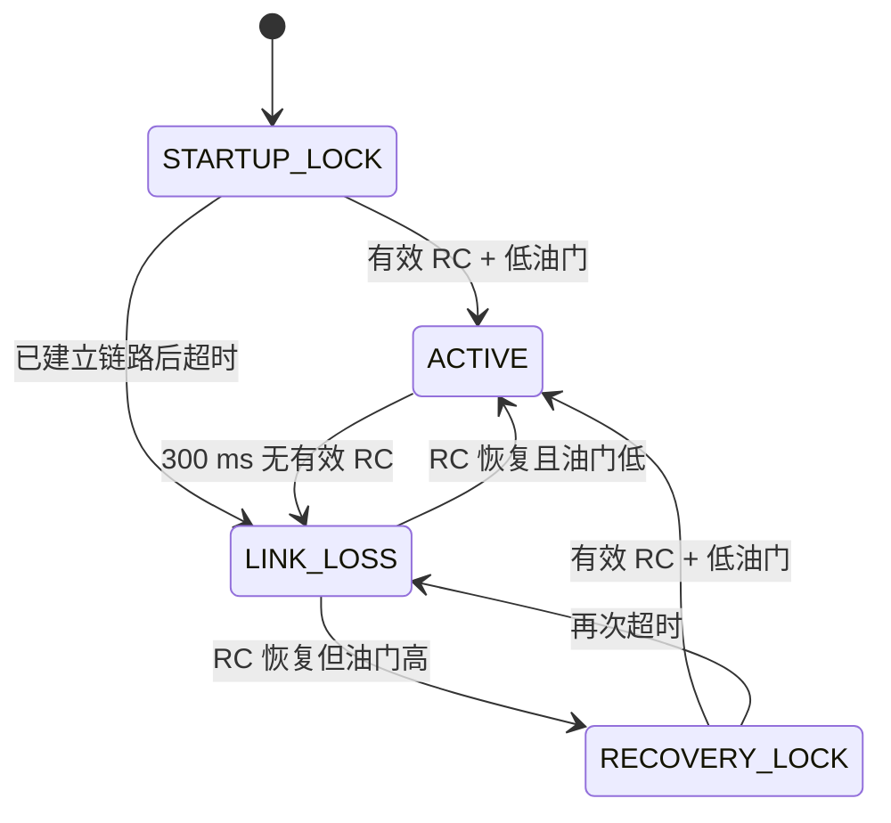

# 飞行安全状态

## 状态机

## 电机放行条件

只有 `ACTIVE` 状态允许写入混控结果。其他状态会：

- 基础油门归零；
- Roll/Pitch/Yaw 目标归零；
- 清除 PID 输出、积分和滤波历史；
- 四路 TIM4 输出写入最小比较值 `500`；
- 失联时清除辅助通道状态。

CRSF 帧必须通过长度和 CRC8 DVB-S2 校验，才会刷新链路时间。

## 已知限制

当前没有正式的 ARM/DISARM 开关。系统在收到低油门后进入 `ACTIVE`，随后允许油门上升。这比直接上电运行安全，但不满足完整产品级解锁要求。

在飞行测试前应继续完成：

1. 选定并记录独立 ARM 通道；
2. 增加明确的 DISARM 状态；
3. 对倾角、传感器健康、主从数据新鲜度和电池状态设置解锁前置条件；
4. 增加硬故障和看门狗复位原因记录；
5. 完成无桨、系留和故障注入测试。

## 最低测试矩阵

| 场景 | 预期结果 |
|---|---|
| 上电且油门高 | 四路保持最小输出 |
| 首次低油门有效帧 | 允许进入 ACTIVE |
| ACTIVE 后拔掉接收机 | 300 ms 内进入 LINK_LOSS |
| 高油门重连 | 保持 RECOVERY_LOCK |
| 重连后油门降至阈值 | 允许重新进入 ACTIVE |
| CRSF CRC 错误 | 不刷新链路时间 |
| 主从 CRC 错误 | 不发布传感器数据，错误计数增加 |

所有电机相关测试首先在拆除桨叶的情况下进行。
